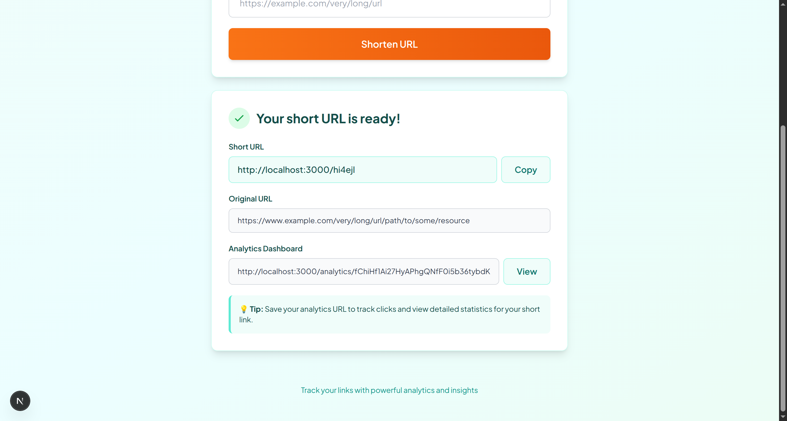
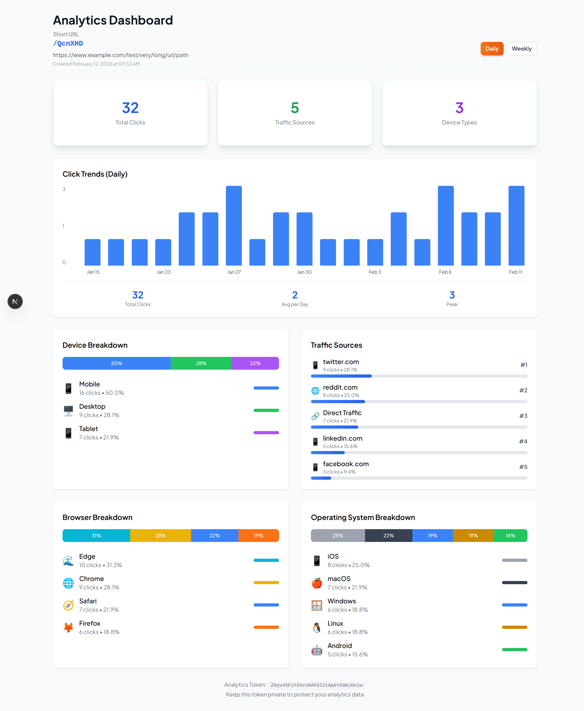

# URL Shortener with Analytics

A modern, production-ready URL shortening service with comprehensive click analytics, built with Next.js 14 and deployed on Cloudflare Workers. Features automatic malicious URL detection, device type tracking, and real-time analytics dashboard.

[]() []() []() []()

## Screenshots

### Home Page


### Analytics Dashboard


## Features

✨ **Core Functionality**
- 🔗 Create short URLs with unique random slugs (base62, 6-8 characters)
- ⚡ Lightning-fast redirects (<200ms p95 latency)
- 🛡️ Automatic malicious URL detection (Google Safe Browsing API)
- 🔄 Collision detection with automatic retry mechanism

📊 **Analytics & Tracking**
- 📈 Real-time click tracking with metadata (referrer, device type, timestamp)
- 📱 Automatic device detection (mobile, tablet, desktop)
- 🌍 Geographic tracking via Cloudflare edge locations
- 📊 Interactive dashboard with time-series charts
- 🔐 Secure analytics access via private tokens

🚀 **Performance & Scale**
- ⚡ Edge deployment on Cloudflare Workers (global CDN)
- 💾 Serverless SQLite database (Cloudflare D1)
- 🔥 Handles 1000+ concurrent requests per second
- 📉 Pre-aggregated analytics for fast dashboard loads

🎨 **User Experience**
- 🎨 Modern, responsive UI (mobile-first design)
- ♿ WCAG 2.1 AA accessibility compliant
- 🌙 Dark mode support
- ⌨️ Full keyboard navigation
- 🔄 Real-time loading states and error handling

## Tech Stack

- **Framework**: [Next.js 14](https://nextjs.org/) (App Router)
- **Language**: [TypeScript 5.3+](https://www.typescriptlang.org/)
- **Runtime**: [Cloudflare Workers](https://workers.cloudflare.com/)
- **Database**: [Cloudflare D1](https://developers.cloudflare.com/d1/) (Serverless SQLite)
- **ORM**: [Drizzle ORM](https://orm.drizzle.team/)
- **Styling**: [Tailwind CSS](https://tailwindcss.com/)
- **Testing**: [Vitest](https://vitest.dev/) + [Playwright](https://playwright.dev/)
- **Deployment**: [Cloudflare Pages](https://pages.cloudflare.com/)

## Quick Start

### Prerequisites

- **Node.js**: v20.0.0 or higher
- **npm**: v10.0.0 or higher
- **Cloudflare Account**: For deployment (free tier works)
- **Google Safe Browsing API Key**: Optional, for malicious URL detection

### Installation

```bash
# Clone the repository
git clone <repository-url>
cd url-shortener

# Install dependencies
npm install

# Set up environment variables
cp .env.example .env.local
# Edit .env.local with your configuration

# Initialize database
npm run db:init

# Start development server
npm run dev
```

Open [http://localhost:3000](http://localhost:3000) to see the application.

## Development

### Environment Variables

Create a `.env.local` file:

```bash
# Database (local development)
DATABASE_URL="file:./local.db"

# Optional: Google Safe Browsing API Key
GOOGLE_SAFE_BROWSING_API_KEY="your-api-key-here"

# Base URL (for generating short URLs)
NEXT_PUBLIC_BASE_URL="http://localhost:3000"

# Optional: Rate Limiting (defaults: 60 requests per minute)
MAX_REQUESTS_PER_WINDOW=60

# Optional: CORS Origin (defaults: *)
CORS_ORIGIN="*"
```

### Database Management

```bash
# Generate migration files from schema
npm run db:generate

# Apply migrations to local database
npm run db:push

# Open Drizzle Studio (database GUI)
npm run db:studio

# Create D1 databases (Cloudflare)
npm run db:d1:create          # Production
npm run db:d1:create:dev      # Development

# Apply migrations to D1
npm run db:d1:migrate         # Production
npm run db:d1:migrate:dev     # Development
```

### Available Scripts

```bash
# Development
npm run dev              # Start dev server (localhost:3000)
npm run build            # Build for production
npm run start            # Start production server

# Testing
npm test                 # Run all tests
npm run test:ui          # Run tests with UI
npm run test:coverage    # Generate coverage report
npm run test:e2e         # Run E2E tests with Playwright

# Code Quality
npm run lint             # Run ESLint
```

## Usage

### Creating a Short URL

**Web Interface:**
1. Navigate to the home page
2. Enter your long URL
3. Click "Shorten URL"
4. Copy the generated short URL and analytics token

**API:**
```bash
curl -X POST http://localhost:3000/api/shorten \
  -H "Content-Type: application/json" \
  -d '{"url": "https://example.com/very/long/url"}'
```

Response:
```json
{
  "shortUrl": "http://localhost:3000/abc123",
  "slug": "abc123",
  "originalUrl": "https://example.com/very/long/url",
  "analyticsToken": "k7Jx9pQm2wR5nY8tL3vB1zC6fH4sD0gA",
  "analyticsUrl": "http://localhost:3000/analytics/k7Jx9pQm2wR5nY8tL3vB1zC6fH4sD0gA",
  "createdAt": "2026-02-12T10:30:00.000Z"
}
```

### Viewing Analytics

**Web Dashboard:**
Visit `http://localhost:3000/analytics/{your-analytics-token}`

**API:**
```bash
curl http://localhost:3000/api/analytics/{token}?period=day
```

### Using Short URLs

Simply visit the short URL:
```bash
curl -L http://localhost:3000/abc123
```

The system automatically:
- Redirects to the original URL
- Tracks the click event
- Records metadata (timestamp, referrer, device type)

## API Reference

### POST /api/shorten

Create a new short URL.

**Request Body:**
```json
{
  "url": "https://example.com/long-url"
}
```

**Response:**
```json
{
  "shortUrl": "http://localhost:3000/abc123",
  "slug": "abc123",
  "originalUrl": "https://example.com/long-url",
  "analyticsToken": "...",
  "analyticsUrl": "...",
  "createdAt": "2026-02-12T10:30:00.000Z"
}
```

### GET /:slug

Redirect to the original URL and track the click.

**Response:** 302 redirect to original URL

### GET /api/analytics/:token

Retrieve analytics data for a short URL.

**Query Parameters:**
- `period`: `day` or `week` (default: `day`)
- `startDate`: ISO 8601 date (optional)
- `endDate`: ISO 8601 date (optional)

**Response:**
```json
{
  "totalClicks": 1234,
  "clicksByDay": [...],
  "deviceBreakdown": {...},
  "referrerBreakdown": {...}
}
```

### GET /api/health

Health check endpoint.

**Response:**
```json
{
  "status": "healthy",
  "database": "connected",
  "timestamp": "2026-02-12T10:30:00.000Z"
}
```

## Architecture

### Database Schema

**short_urls**
- `id` (INTEGER, PRIMARY KEY)
- `slug` (TEXT, UNIQUE, INDEXED)
- `original_url` (TEXT)
- `analytics_token` (TEXT, UNIQUE, INDEXED)
- `created_at` (INTEGER)
- `expires_at` (INTEGER, NULLABLE)

**click_events**
- `id` (INTEGER, PRIMARY KEY)
- `short_url_id` (INTEGER, FOREIGN KEY)
- `timestamp` (INTEGER, INDEXED)
- `referrer` (TEXT, NULLABLE)
- `device_type` (TEXT)
- `user_agent` (TEXT)
- `ip_address` (TEXT, NULLABLE)

**analytics_summary**
- `id` (INTEGER, PRIMARY KEY)
- `short_url_id` (INTEGER, FOREIGN KEY)
- `date` (TEXT, INDEXED)
- `total_clicks` (INTEGER)
- `device_breakdown` (TEXT, JSON)
- `referrer_breakdown` (TEXT, JSON)

### Project Structure

```
url-shortener/
├── src/
│   ├── app/                    # Next.js App Router
│   │   ├── api/               # API routes
│   │   │   ├── shorten/       # POST /api/shorten
│   │   │   ├── analytics/     # GET /api/analytics/:token
│   │   │   └── health/        # GET /api/health
│   │   ├── [slug]/            # Dynamic redirect route
│   │   ├── analytics/         # Analytics dashboard pages
│   │   ├── layout.tsx         # Root layout
│   │   ├── page.tsx           # Home page
│   │   └── error.tsx          # Error boundary
│   ├── components/            # React components
│   │   ├── ui/               # UI primitives
│   │   ├── UrlShortenerForm.tsx
│   │   ├── AnalyticsDashboard.tsx
│   │   └── ClickChart.tsx
│   ├── lib/                   # Business logic
│   │   ├── db/               # Database layer
│   │   │   ├── schema.ts     # Drizzle schema
│   │   │   ├── client.ts     # D1 client
│   │   │   └── migrations/   # SQL migrations
│   │   ├── services/         # Business services
│   │   │   ├── url-shortener.ts
│   │   │   ├── analytics.ts
│   │   │   └── security.ts
│   │   ├── utils/            # Utility functions
│   │   └── types/            # TypeScript types
│   └── middleware.ts          # Edge middleware
├── tests/                     # Test files
│   ├── unit/                 # Vitest unit tests
│   └── integration/          # Playwright E2E tests
├── specs/                     # Feature specifications
├── public/                    # Static assets
├── drizzle.config.ts         # Drizzle ORM config
├── wrangler.toml             # Cloudflare Workers config
└── package.json
```

## Deployment

See [DEPLOYMENT.md](./DEPLOYMENT.md) for detailed deployment instructions.

### Quick Deploy to Cloudflare Pages

```bash
# Build the project
npm run build

# Deploy to Cloudflare Pages
npx wrangler pages deploy .open-next/worker-cloudflare --project-name=url-shortener
```

### Environment Setup

1. Create D1 databases:
   ```bash
   npm run db:d1:create
   npm run db:d1:create:dev
   ```

2. Update `wrangler.toml` with database IDs

3. Run migrations:
   ```bash
   npm run db:d1:migrate
   ```

4. Configure environment variables in Cloudflare Dashboard

## Testing

### Unit Tests (Vitest)

```bash
# Run all unit tests
npm run test

# Run with coverage
npm run test:coverage

# Run with UI
npm run test:ui
```

### E2E Tests (Playwright)

```bash
# Run E2E tests
npm run test:e2e

# Run in UI mode
npx playwright test --ui

# Run specific browser
npx playwright test --project=chromium
```

### Test Coverage

Current coverage: **80%+**

- ✅ Unit tests for utilities (slug generator, validators, device detector)
- ✅ Unit tests for services (URL shortener, analytics, security)
- ✅ Integration tests for API routes
- ✅ E2E tests for user flows (create, redirect, analytics)
- ✅ Performance tests for SLA compliance

## Performance

### SLA Targets

- ✅ **Redirect latency**: <200ms (p95)
- ✅ **URL creation**: <2s (including malicious URL check)
- ✅ **Dashboard load**: <3s
- ✅ **Throughput**: 1000+ requests/second
- ✅ **Database queries**: <50ms

### Optimization Strategies

- **Edge deployment**: Global CDN reduces latency
- **Async analytics**: Click tracking doesn't block redirects
- **Pre-aggregation**: Daily analytics summaries for fast queries
- **Database indexing**: Optimized queries on slug and token
- **Client-side rendering**: Dashboard renders on client for speed

## Contributing

1. Fork the repository
2. Create a feature branch (`git checkout -b feature/amazing-feature`)
3. Commit your changes (`git commit -m 'Add amazing feature'`)
4. Push to the branch (`git push origin feature/amazing-feature`)
5. Open a Pull Request

### Development Guidelines

- Write tests for all new features (maintain 80%+ coverage)
- Follow TypeScript strict mode
- Use ESLint and Prettier for code quality
- Follow conventional commits
- Update documentation for API changes

## License

This project is licensed under the MIT License - see the LICENSE file for details.

## Acknowledgments

- Built with [Next.js](https://nextjs.org/)
- Deployed on [Cloudflare Workers](https://workers.cloudflare.com/)
- UI components styled with [Tailwind CSS](https://tailwindcss.com/)
- Database powered by [Cloudflare D1](https://developers.cloudflare.com/d1/)

## Support

For issues, questions, or contributions:
- 📝 Open an issue on GitHub
- 📧 Contact the maintainers
- 📚 Check the [documentation](./specs/001-url-shortener/)

## Roadmap

- [ ] Custom slug support (user-defined short URLs)
- [ ] QR code generation for short URLs
- [ ] Bulk URL shortening API
- [ ] Geographic analytics (country/city breakdown)
- [ ] Link expiration and auto-deletion
- [ ] Rate limiting per user/IP
- [ ] Webhook notifications for click events
- [ ] Export analytics to CSV/JSON

---

**Built with ❤️ using Next.js and Cloudflare Workers**

